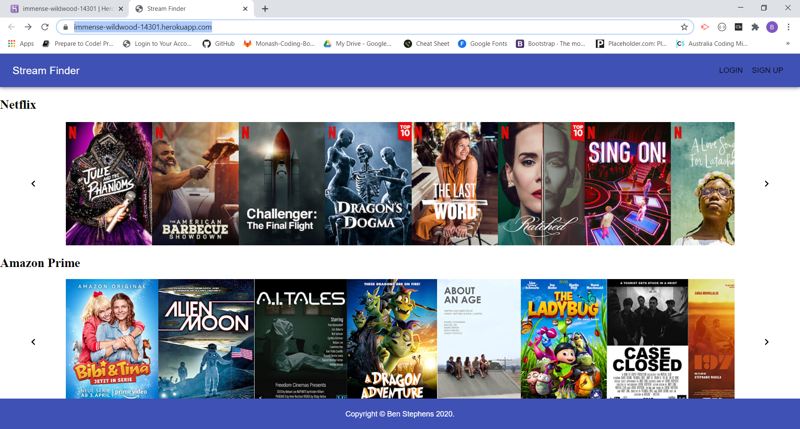

# Stream Finder

    

## Description 

A React based app to search for movies or tv shows and the specific streaming platforms that they are available on 
## Links

<a href="https://github.com/ben-j-st/Stream-Finder">React Profile</a>
<a href="https://immense-wildwood-14301.herokuapp.com/">Live Herkou Version</a>

## Table of Contents

* [Description](#Description)
* [Installation](#Installation)
* [Usage](#Usage)
* [Licence](#Licence)
* [Contributing](#Contributing)
* [Tests](#Tests)
* [Questions](#Questions)
* [Screenshot](#Screenshot)
* [Walkthrough](#Walkthrough-video)

## Installation

Step 1 - Clone down the repo

Step 2 - run npm i to install all dependencies

Step 3 - Use App

## Usage

Use npm start to run application 

## Licence 

MIT

A short and simple permissive license with conditions only requiring preservation of copyright and license notices. Licensed works, modifications, and larger works may be distributed under different terms and without source code. see full licence at https://choosealicense.com/licenses/mit/

## Contributing 

No contributors, but had some very basic guidelines from trilogy

## Tests

none at this time

## Questions

Github Username: <a href="https://github.com/ben-j-st">ben-j-st</a>

Email: ben_j_stephens@hotmail.com

## Screenshot 

 

